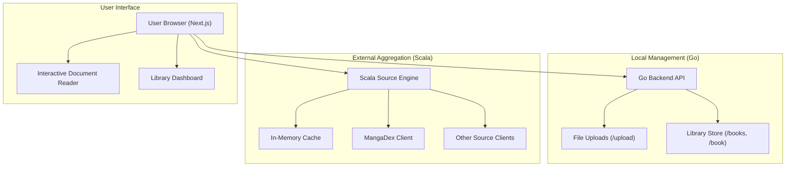

# 📚 BookNerd — Comprehensive Multi-Tier Library Engine


**BookNerd** is a comprehensive, multi-tier application designed to act as your ultimate digital library, document manager, and external source reading engine.

Unlike simple book readers, BookNerd aggregates content dynamically, provides robust local document management, and offers a smooth, highly responsive reading experience.

---

## ⚡ Key Features

- **🚀 Multi-Source Aggregation**: Seamlessly fetch and read books or manga from external providers (e.g., MangaDex) using a dedicated Scala source engine.
- **🏗️ Robust API Layer**: High-performance Go-based REST API to handle library management and document uploads.
- **🗄️ In-Memory Caching**: Efficient data retrieval in the Scala source aggregator using an in-memory cache to reduce external API latency.
- **📊 Modern Web Interface**: A sleek, responsive Next.js frontend styled with Tailwind CSS for an optimal reading experience.
- **🧬 Unified Launch Ecosystem**: A central Makefile that simplifies orchestrating the frontend, Go backend, and Scala engine concurrently.

---

## 🏗️ Architecture

BookNerd follows a **Microservice-Oriented** pattern, splitting concerns between frontend rendering, local library management, and external source aggregation.



---

## 🧰 Technology Stack

| Component              | Responsibility                              | Technology                   |
| :--------------------- | :------------------------------------------ | :--------------------------- |
| **Frontend**           | User interface, reading engine, and routing | Next.js, React, TailwindCSS  |
| **Backend (API)**      | Local library management & uploads          | Go (net/http)                |
| **Source Engine**      | External source aggregation & caching       | Scala, sbt                   |

---

## 🚀 Getting Started

### 1. Prerequisite Setup

Ensure you have the following installed:

- [Node.js](https://nodejs.org/) & npm (v18+)
- [Go](https://go.dev/) (v1.20+)
- [Scala & sbt](https://www.scala-lang.org/download/)

### 2. Component Execution

A central `Makefile` is provided at the root to simplify running different components.

#### 🌟 Run Everything Together
To launch the Frontend, Go Backend, and Scala Source Engine concurrently:
```bash
make dev-all
```

#### 🏗️ Run Components Individually
- **Frontend only:** `make fe`
- **Go Backend only:** `make be`
- **Scala Engine only:** `make scala`
- **Frontend + Go Backend:** `make dev`

---

## 🛠️ Sub-System Deep Dives

### 🏗️ Local Library API (Go)
The Go backend ensures fast execution and high concurrency for local document management:
- `/upload`: Handles robust file uploads with CORS support.
- `/books` & `/book`: Endpoints for querying the local library catalog.

### 🔍 Source Engine (Scala)
The `source_engine` operates as a dedicated aggregator. It interfaces with external clients (like MangaDex) and normalizes their data formats. An `InMemoryCache` layer intercepts repeated queries to minimize latency and prevent API rate-limiting.

---

## 🎯 Project Roadmap

- [x] **Phase 1**: Core Next.js Frontend and reading interface.
- [x] **Phase 2**: Go Backend API for document uploads.
- [x] **Phase 3**: Scala Source Engine for external aggregations.
- [x] **Phase 4**: MangaDex Client integration.
- [ ] **Phase 5**: Persistent database integration for the Go Backend.
- [ ] **Phase 6**: Advanced user authentication and library syncing.
- [ ] **Phase 7**: E-Ink device synchronization support.

---

## 📄 License

This project is for personal library management and observability. All rights reserved.

Created by **@pd241008**
